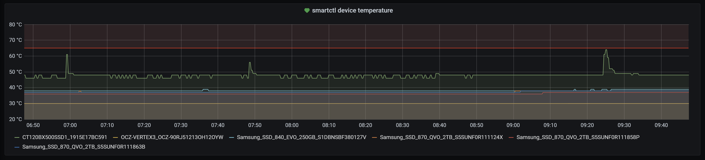

# Prometheus smartctl temperature exporter

An exporter for the disk temperature reported by `smartctl`, written in Rust.



[](LICENSE) 

[](https://crates.io/crates/prometheus_smartctl_temperature_exporter) [](https://crates.io/crates/prometheus_smartctl_temperature_exporter) [](https://crates.io/crates/prometheus_smartctl_temperature_exporter)

[](https://github.com/MindFlavor/prometheus_smartctl_temperature_exporter/tree/1.0.0)
[](https://github.com/MindFlavor/prometheus_smartctl_temperature_exporter/tree/1.0.0)

[](https://github.com/mindflavor/prometheus_smartctl_temperature_exporter/actions?query=workflow%3ARust)
[](https://img.shields.io/github/commits-since/mindflavor/prometheus_smartctl_temperature_exporter/1.0.0.svg)


[](https://hub.docker.com/r/mindflavor/prometheus-smartctl-temperature-exporter)

## What is this?

This tool, upon Prometheus's request - enumerates your disks via `lsblk` command and for each block device of type disk will issue `smartctl -a -j`. It then proceeds to extract the temperature and present it in a valid Prometheus format, like this:

```
# HELP smartctl_device_temperature device temperature as reported by smartctl
# TYPE smartctl_device_temperature gauge
smartctl_device_temperature{device="Samsung_SSD_840_EVO_250GB_S1DBNSBF380127V"} 39
smartctl_device_temperature{device="Samsung_SSD_870_QVO_2TB_S5SUNF0R111858P"} 37
smartctl_device_temperature{device="Samsung_SSD_870_QVO_2TB_S5SUNF0R111863B"} 38
smartctl_device_temperature{device="OCZ-VERTEX3_OCZ-90RJ51213OH12OYW"} 30
smartctl_device_temperature{device="CT120BX500SSD1_1915E17BC591"} 48
smartctl_device_temperature{device="Samsung_SSD_870_QVO_2TB_S5SUNF0R111124X"} 38
```

## Why

I needed to resilver my ZFS array and I was concerned by overheating my disks because of the sustained operation. Unfortunately, while `smartctl` exposes the disk temperature, I was not able to import it in Prometheus in a straightforward manner, so I ended up writing a specialized Rust process that does just that. It's probably an overkill but being Rust it is super cheap to run.

## Requirements

You need to have both `lsblk` and `smartctl` executables available in the `$PATH`. Also, since `smartctl` requires root privileges, you need to run the tool as root (or use the *prepend sudo* option).
Ah, you also need Rust to compile the tool. You can use the docker image, courtesy of [Quentin McGaw](https://github.com/qdm12) as it does everything for you.

## Options

Option | Mandatory | Accepted values | Default | Multiple | Description
-- | -- | -- | -- | -- | --
`-a` | No | - | No | No | Prepends `sudo` to the `smartctl` commands. Useful to avoid running the exporter as root.
`-v` | No | - | No | No | Enable verbose logging. Useful for troubleshooting.
`-l` | No | Any valid IP | `0.0.0.0` | No | IP address to listen from. Default listens on every device.
`-p` | No | Any valid TCP port | 9587 | No | TCP port opened by the tool. Must be free.
`-e` | No | Any valid regex | - | Yes | Regular expressions to exclude from the analysis. For example `z.*` excludes /dev/zXX disks (in my case these are ZFS virtual block devices). Useful to avoid warnings about not supported disks.

## Hey, the tools says it does not support my hard disk! What should I do?

The output of `smartctl` depends heavily on the disk model. If your disk is not supported (as reported by the tool) all you have to do is to issue `sudo systemctl -a -j /dev/sdX` (where X is your disk) and open a issue with the resulting json. I will update the tool to support your disk as soon as possible.
